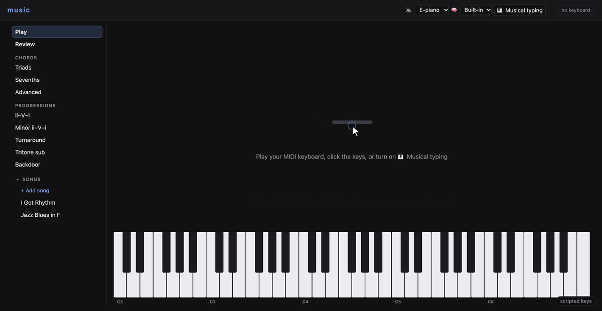

<p align="center">
  
</p>

<h1 align="center">Changes</h1>

<p align="center">
  Learn jazz changes by playing them. A chord trainer and song memorizer that grades<br>
  what your hands play — on a MIDI keyboard, the on-screen piano, or your computer keys.
</p>

<p align="center">
  <a href="https://tylerwhughes.com/changes/"><b>Practice in your browser</b></a><br>
  <sub>or <a href="#install">install it</a> to import your own charts and use Anki</sub>
</p>

<br>



## Practice

One tree, top to bottom:

- **Play** — where the page opens: just play. The chord you hold is named as you play it, on a
  full-width piano; no cards, no grading.
- **Review** — every card that is due, from every deck and song. Spaced repetition is built in
  (a small SM-2 scheduler, kept in your browser); Anki is optional.
- **Chords** — triads, sevenths, and the jazz chords under **Advanced**: half-diminished
  (m7♭5), diminished (dim7), sus (7sus4) and augmented (7♯5). All 12 keys, any voicing;
  **Show keys** lights one voicing when a chord is new to you. The grade counts your wrong
  attempts and your speed.
- **Progressions** — the jazz ones: ii–V–I, minor ii–V–i, the I–vi–ii–V turnaround, the tritone
  sub (ii–♭II7–I) and the backdoor (iv–♭VII7–I). Each in all 12 keys, one card per progression.
- **Songs** — every chart in one list that folds away. Each tune's changes, three ways:
  - **Chords** — every chord in the tune, shuffled.
  - **Phrases** — each printed line from memory, cued by the chord before it. These are the
    review cards.
  - **Play through** — the tune in order: the chord now, the next two beside it, its keys lit.
    **Blind** hides them when you are ready.

A **grading dial** sets what a song asks for: *Core* (root and chord type — B7♭9 practises as B7,
and the ♭9 is welcome), *As written*, or *Triads*.

## How it works

- **One matcher, two runtimes.** The chord matcher, the drill engine, the grade policy and the
  scheduler are Python; the page carries a JavaScript twin of each. On every test run the Python
  writes fresh cases — 10,200 chord verdicts, 1,200 grades, 24 scheduler walks, 160 drill
  traces and 20 whole practice sessions — and the JavaScript must give the same answer to
  every one.
- **Charts are text.** A song is a small file you can read and fix: one text line per printed
  line, endings, repeats, beats.

  ```
  [A]
  | Bbmaj7 G-7 | C-7 F7 | D-7 G-7 | C-7 F7 |
  | F-7 Bb7 | Ebmaj7 Ab7 | 1. D-7 G-7 | 1. C-7 F7 | 2. C-7 F7 | 2. Bb6 |
  ```
- **The sound is a sampled electric piano** — or the S-1 twin, the software model of Roland's
  S-1 from [s1-twin](https://github.com/twhughes/s1-twin), here with 8 voices so chords ring and
  its knobs a click away; or open the full S-1 twin page beside it and this page plays whatever
  you dial in there — or off if your keyboard makes its own sound.
- **Import a page** (local app): drop a Real Book page or a link, and Claude reads it twice,
  independently; every bar where the two reads disagree is flagged beside the scan for you to
  check. The reads run in a locked-down Claude call that can only read the page.

## Status, honestly

- 315 Python tests pass, and they run the browser checks too (every view, the parity cases, the
  page runtime); every screen was checked in headless Chrome at 1470×760, served from a
  sub-path the way GitHub Pages serves it. Nobody has played it on a real keyboard yet.
- The page runs everything except imports and Anki, which need the local app.
- Safari has no Web MIDI: use the on-screen piano or your computer keys there, or Chrome.
- Two songs ship with the page: *I Got Rhythm* (Gershwin, 1930 — public domain in the US since
  2026) and a jazz blues in F. Bring your own with the local app.

## Install

Python 3.11+ and Node (for the view checks).

```bash
git clone https://github.com/twhughes/changes && cd changes
python -m venv .venv && .venv/bin/pip install -e ".[dev]"
./run.sh                # the cockpit at http://127.0.0.1:8768
```

<details><summary>Optional: Anki, page imports</summary>

- **Anki** — install the AnkiConnect add-on, open Anki, and pick *Anki* in the 🧠 menu.
- **Page imports** — needs the [Claude Code](https://claude.com/claude-code) CLI on your PATH.
  `python -m music.songs add <file-or-url>` works from the terminal too.
</details>

## Credits

Wurlitzer EP200 samples by Greg Sullivan (CC-BY 3.0). The S-1 twin is the same author's
[s1-twin](https://github.com/twhughes/s1-twin). MIT License.
